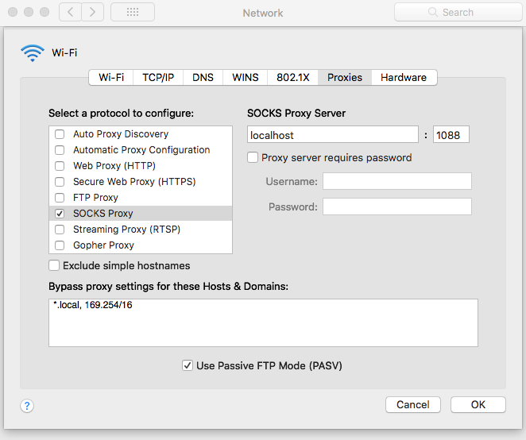

# firethewall

> 科学上网、搬梯子工具

## 我是如何上Youtube的
分享一个我的翻墙方法。首先要到国外租一台服务器，然后用ssh建立连接的同时，在本地做一个映射的代理端口。最后配置本机代理服务，让所有流量走代理端口。这样做就相当于本机与墙外的服务器建立一个加密隧道，所有的网络连接都是从外网的服务器发出与取回，再传回到国内的主机。

这样做的好处是根本不会被封掉，到外网的通讯都是非对称加密，GFW应该不会发现。这个项目就是为了简化我整个上网过程而建立的。假设是没有固定的服务器在国外。脚本功能如下：
* 使用DigitalOcean的API创建主机，配制SSH密钥等
* 获取建立ssh隧道连接的信息
* 销毁云上的主机，不用时可以停掉服务器，减少花费

## Hankbook

### 1. 注册DigitalOcean账号
推荐使用 [DigitalOcean](https://www.digitalocean.com/?refcode=cc0edbf24578) 的服务。
DigitalOcean是一家建立于美国的云基础架构提供商，面向软件开发人员提供虚拟专用服务器（VPS）。该公司总部设在纽约市，并在世界各地拥有数据中心。2015年12月，DigitalOcean成为了全球第二大面向Web的网络寄存服务公司。
使用这个链接注册可以获得$10的使用额度。最低资源的服务器为$5一个月，可以使用2个月。不用上网时可以删掉主机，节省费用，$10可以用很久。
```
https://www.digitalocean.com/?refcode=cc0edbf24578
```

### 2. 配置Token和登陆密钥

登陆到DigitalOcean控制台后，依次点击[API]->[Generate New Token]，把创建的Token保存好。然后点击[右上角个人图标]->[Settings]->[Security]->[Add SSH key],将公钥上传。最后将公钥的Fingerprint同样保存好。
如何生成ssh密钥对可以按照[Github的文档](https://help.github.com/articles/connecting-to-github-with-ssh/)。
```
https://help.github.com/articles/connecting-to-github-with-ssh/
```
### 3. 添加验证信息到脚本

打开编辑脚本：
```python
TOKEN = "XXX"
FINGERPRINT = "XXX"
```
将上一步保存下来的Token和Fingerprint替换XXX。

### 4. 运行脚本

1. 创建主机
```
python3 firethewall.py connect
```
2. 获取主机连接信息并建立ssh隧道，这里需要根据提示手动执行ssh命令
```
python3 firethewall.py status
```
3. 使用完后，销毁主机
```
python3 firethewall.py destroy
```

### 5. 配置本地代理,以MacOS为例
依次 [Setting]->[Network]->[Advance]->[Proxies]
添加SOCK Proxy如图，端口号要和上一步执行的参数一致，ssh隧道建立后再将选线勾上。使用完，同样要将代理配置去除。否则上不了网。


## END
现在就可以正常浏览网站了。如果遇到网络连接丢失之类的问题，可以先停掉本地代理，使用新的端口号重新建立连接，再更改本地代理配置到新端口。

欢迎指正！
